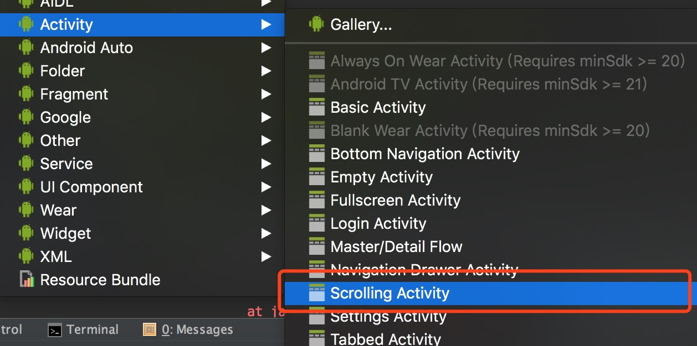
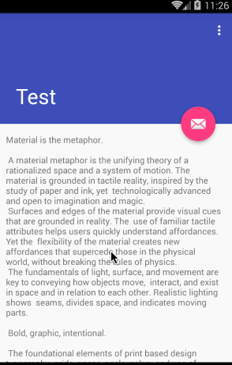
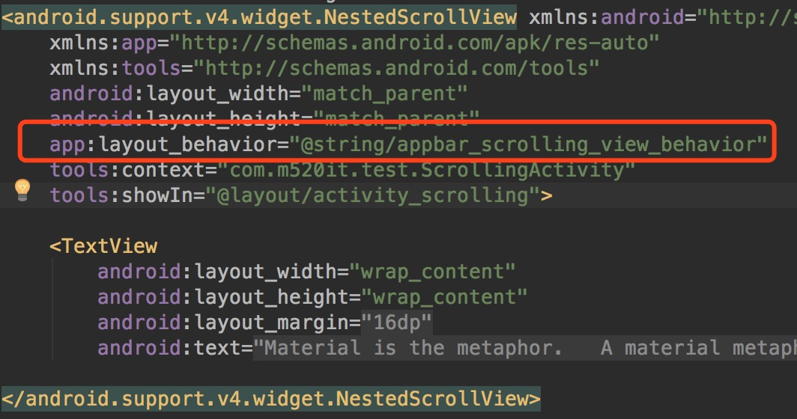
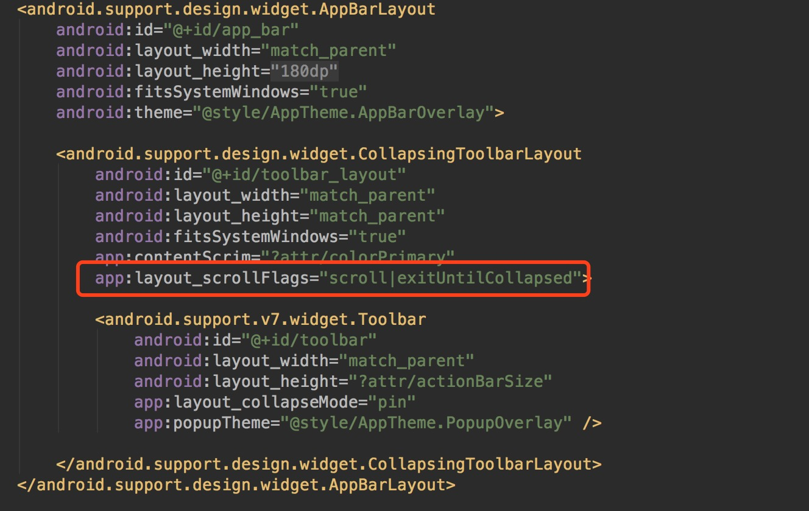
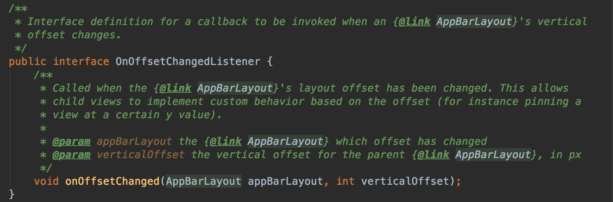
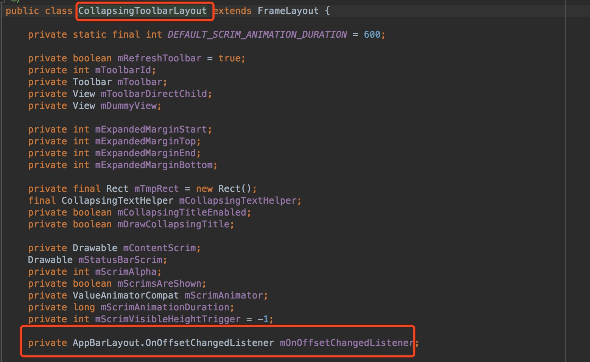
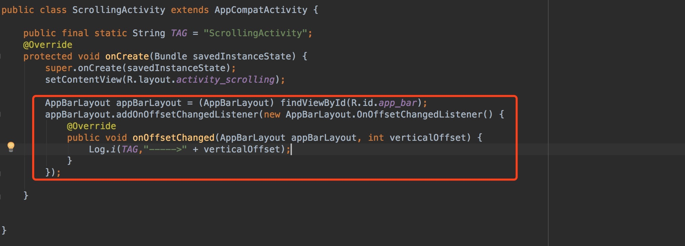
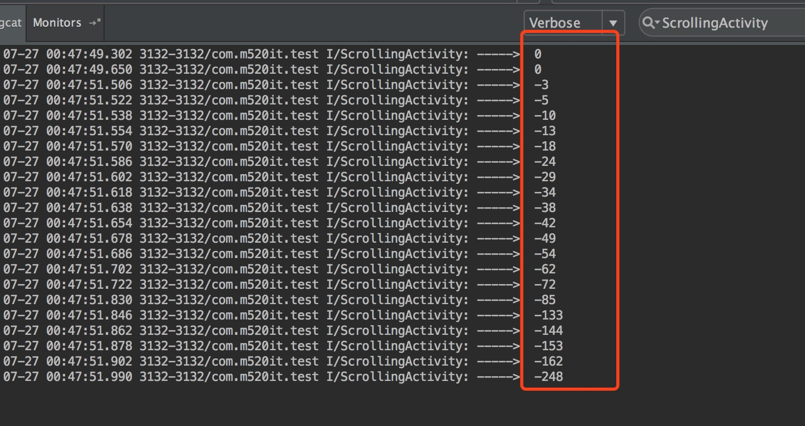
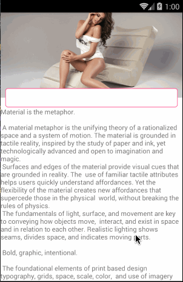

###使用AppBarLayout+CollapsingToolbarLayout实现自定义工具栏折叠效果

最近在公司闲着没事，下了几款app看下有没有好看的效果能不能动手实践下，刚好就看到这个工具栏折叠效果.


这一看不就是跟Material Design工具栏折叠效果类似。我们捋一下效果是怎样的，滑动的时候实现搜索栏渐变以及高度改变的工具栏折叠效果。

知道大概效果，开始撸代码。

首先我们先熟悉下Material Design折叠栏的效果是怎样的。
###准备工作
####相关控件了解

在创建activity的时候，android studio提供了一个叫ScrollingActivity的模版



点击创建后之后出现一个有工具栏折叠效果的activity。



ScrollActivity的布局代码如下：

```Xml
<?xml version="1.0" encoding="utf-8"?>
<android.support.design.widget.CoordinatorLayout xmlns:android="http://schemas.android.com/apk/res/android"
    xmlns:app="http://schemas.android.com/apk/res-auto"
    xmlns:tools="http://schemas.android.com/tools"
    android:layout_width="match_parent"
    android:layout_height="match_parent"
    android:fitsSystemWindows="true"
    tools:context="com.m520it.test.ScrollingActivity">

    <android.support.design.widget.AppBarLayout
        android:id="@+id/app_bar"
        android:layout_width="match_parent"
        android:layout_height="@dimen/app_bar_height"
        android:fitsSystemWindows="true"
        android:theme="@style/AppTheme.AppBarOverlay">

        <android.support.design.widget.CollapsingToolbarLayout
            android:id="@+id/toolbar_layout"
            android:layout_width="match_parent"
            android:layout_height="match_parent"
            android:fitsSystemWindows="true"
            app:contentScrim="?attr/colorPrimary"
            app:layout_scrollFlags="scroll|exitUntilCollapsed">

            <android.support.v7.widget.Toolbar
                android:id="@+id/toolbar"
                android:layout_width="match_parent"
                android:layout_height="?attr/actionBarSize"
                app:layout_collapseMode="pin"
                app:popupTheme="@style/AppTheme.PopupOverlay" />

        </android.support.design.widget.CollapsingToolbarLayout>
    </android.support.design.widget.AppBarLayout>

    <include layout="@layout/content_scrolling" />

    <android.support.design.widget.FloatingActionButton
        android:id="@+id/fab"
        android:layout_width="wrap_content"
        android:layout_height="wrap_content"
        android:layout_margin="@dimen/fab_margin"
        app:layout_anchor="@id/app_bar"
        app:layout_anchorGravity="bottom|end"
        app:srcCompat="@android:drawable/ic_dialog_email" />

</android.support.design.widget.CoordinatorLayout>


```

**AppBarLayout**是一种支持响应滚动手势的app bar布局（比如工具栏滚出或滚入屏幕），CollapsingToolbarLayout则是专门用来实现子布局内不同元素响应滚动细节的布局。

与AppBarLayout组合的滚动布局（Recyclerview、NestedScrollView等）需要设置app:layout_behavior这个属性


没有设置的话，AppBarLayout将不会响应滚动布局的滚动事件。

**CollapsingToolbarLayout和ScrollView一起使用会有滑动bug，注意要使用NestedScrollView来替代ScrollView。**

AppBarLayout的子布局有5种滚动标识(就是上面代码CollapsingToolbarLayout中配置的app:layout_scrollFlags属性)：



- **scroll**:将此布局和滚动时间关联。这个标识要设置在其他标识之前，没有这个标识则布局不会滚动且其他标识设置无效。
- **enterAlways**:任何向下滚动操作都会使此布局可见。这个标识通常被称为“快速返回”模式。
- **enterAlwaysCollapsed**：假设你定义了一个最小高度（minHeight）同时enterAlways也定义了，那么view将在到达这个最小高度的时候开始显示，并且从这个时候开始慢慢展开，当滚动到顶部的时候展开完。
- **exitUntilCollapsed**：当你定义了一个minHeight，此布局将在滚动到达这个最小高度的时候折叠。
- **snap**:当一个滚动事件结束，如果视图是部分可见的，那么它将被滚动到收缩或展开。例如，如果视图只有底部25%显示，它将折叠。相反，如果它的底部75%可见，那么它将完全展开。

**CollapsingToolbarLayout**可以通过app:contentScrim设置折叠时工具栏**布局**的颜色，通过app:statusBarScrim设置折叠时**状态栏**的颜色。默认contentScrim是colorPrimary的色值，statusBarScrim是colorPrimaryDark的色值。

**CollapsingToolbarLayout**的子布局有3种折叠模式（Toolbar中设置的app:layout_collapseMode）

- off：这个是默认属性，布局将正常显示，没有折叠的行为。
- pin：CollapsingToolbarLayout折叠后，此布局将固定在顶部。
- parallax：CollapsingToolbarLayout折叠时，此布局也会有视差折叠效果。

当CollapsingToolbarLayout的子布局设置了parallax模式时，我们还可以通过app:layout_collapseParallaxMultiplier设置视差滚动因子，值为：0~1。

**FloatingActionButton**这个控件通过app:layout_anchor这个设置锚定在了AppBarLayout下方。FloatingActionButton源码中有一个Behavior方法，当AppBarLayout收缩时，FloatingActionButton就会跟着做出相应变化。

了解这么多 大家可以新建个ScrollActivity模版去玩下这些属性

####接下来还有一个问题就是————工具栏的折叠以及展开的状态如何监听？

从上面知道CollapsingToolbarLayout 是负责折叠工具栏的布局，AppBarLayout是负责素响应滚动细节的布局。
那么它们是如何实现联动的？

查看**AppBarLayout**的源码可以看到有这样的一个接口**OnOffsetChangedListerner**



这个接口就是监听当布局AppBarLayout 出现滑动时响应的事件。

而CollapsingToolbarLayout 持有这个**OnOffsetChangedListerner**监听对象



这样我们可以看出当AppBarLayout出现滑动时，CollapsingToolbarLayou通过**OnOffsetChangedListerner**这个对象去响应AppBarLayout的滑动，做出对应工具栏的状态

####使用**OnOffsetChangedListerner**
代码如下：



其中里面offsetChanged 里第二个参数**verticalOffset**含义指的是垂直滑动的距离
当滑动时我们打印看下verticalOffset的值



向上滑动得到的值是负的，初始值为0 就是展开状态。

这里我们需要注意的是verticalOffset能滑动最远距离为 

AppBarLayout的高度 减去 CollapsingToolbarLayout折叠时的高度（这里AppBarLayout可以通过layout_scrollFlags控制CollapsingToolbarLayout设置显示或者隐藏状态）

**注意：在AppBarLayout 中设置android:fitsSystemWindows="true"这个属性回影响verticalOffset最终的值，会加上状态栏的高度**


至此，终于熟悉折叠工具栏的效果时如何实现的，接下来就可以根据上面的原理去实现自定义的工具栏。

###实现自定义折叠工具栏

首先看下我根据上面的原理实现的效果：




####效果分析
当我们滑动时

 - 搜索框背景出现透明的渐变
 - 高度逐渐变小至到跟toolbar工具栏高度一致
 - 搜索框逐渐往上移动到最顶点。

####思路分析

**如何给搜索框背景出现透明渐变？**

我们知道view有个设置透明值的方法 setAlpha(). 参数为 0f到1.0f。
滑动时这个值如何确定，在上面我们提到过AppBarLayout 里有OnOffsetChangedListerner这个滑动监听。

通过这个方法获取到 滑动距离verticalOffset 除以 能滑动的总距离 得出 渐变值。


**如何给搜索框设置高度渐变**

1.首先确定搜索框的高度渐变成工具栏toolbar 渐变百分比差值。


```Java
llHeightOffScale = 1.0f - (toolBarHeight / llHeight)
```

2.toolBarHeight 指的是工具栏toolBar的高度 llHeight是指搜索框布局的高度。

每次滑动时得到的渐变差值为：   

滑动渐变差值／llHeightOffScale = 滑动距离（verticalOffset）／ 能滑动总距离

求出滑动时搜索框对应高度缩放指

```Java
float llHeightScale = 1.0f-(llHeightOffScale*((-verticalOffset)/offSetHeight));
```
3.得出高度

```Java
params.height = (int)(llHeight* llHeightScale);
``` 

**如何设置搜索框布局位移渐变**

这里我是通过滑动时设置搜索框布局的margin来改变（也可以通过调用view的setTranslationY来变化Y轴距离）

1.通过LayoutParams获取topMargin值

```
//得到滑动差值 就是布局marginTop
llOffDistance = params.topMargin;
```

2.计算出每次滑动时marginTop的值，并设置

搜索框布局滑动时的距离／总的滑动差值llOffDistance = 滑动距离／能滑动总距离

根据这个计算出滑动时的marginTop值

```
float distance = llOffDistance - (-verticalOffset)*llOffDistance / offSetHeight;
```

3.设置给搜索框布局

```Java
params.setMargins(0,(int)distance,0,0);
//重新布局子控件
fl.requestLayout();
```

下面给出布局代码以及Activity代码：

```Xml
<?xml version="1.0" encoding="utf-8"?>
<FrameLayout xmlns:android="http://schemas.android.com/apk/res/android"
    xmlns:app="http://schemas.android.com/apk/res-auto"
    xmlns:tools="http://schemas.android.com/tools"
    android:id="@+id/fl"
    android:background="#fff"
    android:layout_width="match_parent"
    android:layout_height="match_parent"
    >
    <android.support.design.widget.CoordinatorLayout
        android:layout_width="match_parent"
        android:layout_height="match_parent"
        tools:context="com.m520it.myapplication.TestScrollActivity">

        <android.support.design.widget.AppBarLayout
            android:id="@+id/app_bar"
            android:layout_width="match_parent"
            android:layout_height="@dimen/app_bar_height"
            android:theme="@style/AppTheme.AppBarOverlay">

            <android.support.design.widget.CollapsingToolbarLayout
                android:id="@+id/toolbar_layout"
                android:layout_width="match_parent"
                android:layout_height="match_parent"
                app:statusBarScrim="@android:color/transparent"
                app:contentScrim="@android:color/transparent"
                app:layout_scrollFlags="scroll|snap|exitUntilCollapsed">

                <ImageView
                    android:id="@+id/image"
                    android:layout_width="match_parent"
                    android:layout_height="match_parent"
                    app:layout_collapseMode="none"
                    android:src="@mipmap/test"
                    android:scaleType="centerCrop"/>
                <android.support.v7.widget.Toolbar
                    android:id="@+id/toolbar"
                    android:layout_width="match_parent"
                    android:layout_height="@dimen/tool_bar_height"
                    app:layout_collapseMode="none"
                    app:contentInsetStart="0dp"
                    app:popupTheme="@style/AppTheme.PopupOverlay" />

            </android.support.design.widget.CollapsingToolbarLayout>
        </android.support.design.widget.AppBarLayout>

        <include layout="@layout/content_test_scroll" />


    </android.support.design.widget.CoordinatorLayout>
    <!--搜索框布局 -->
    <RelativeLayout
        android:id="@+id/ll"
        android:layout_width="match_parent"
        android:layout_height="wrap_content"
        app:layout_anchor="@id/app_bar"
        android:layout_marginTop="150dp"
        app:layout_anchorGravity="bottom">
        <TextView
            android:id="@+id/bac"
            android:layout_width="match_parent"
            android:layout_height="60dp"
            android:background="@color/colorPrimary"/>
        <EditText
            android:id="@+id/fab"
            android:layout_width="match_parent"
            android:layout_height="40dp"
            android:layout_margin="@dimen/fab_margin"
            android:focusable="false"
            android:background="@drawable/et_bac"
            />
    </RelativeLayout>

</FrameLayout>

```

Activity代码

```
public class TestScrollActivity extends AppCompatActivity {

    private float totalHeight;      //总高度
    private float toolBarHeight;    //toolBar高度
    private float offSetHeight;     //总高度 -  toolBar高度  布局位移值
    private float llHeight;         //搜索框高度

    private float llHeightOffScale;     //高度差比值
    private float llOffDistance;        //距离差
    private float llOffDistanceScale;   //距离差比值
    private FrameLayout.LayoutParams params;

    @BindView(R.id.toolbar)
    Toolbar toolbar;
    @BindView(R.id.toolbar_layout)
    CollapsingToolbarLayout toolbarLayout;
    @BindView(R.id.app_bar)
    AppBarLayout appBar;
    @BindView(R.id.fab)
    EditText fab;
    @BindView(R.id.ll)
    RelativeLayout ll;
    @BindView(R.id.bac)
    TextView bac;
    @BindView(R.id.fl)
    FrameLayout fl;
    @BindView(R.id.image)
    ImageView image;

    @Override
    protected void onCreate(Bundle savedInstanceState) {
        super.onCreate(savedInstanceState);
        setContentView(R.layout.activity_scrolling2);
        ButterKnife.bind(this);

        bac.setAlpha(0f);
        totalHeight = getResources().getDimension(R.dimen.app_bar_height);
        toolBarHeight = getResources().getDimension(R.dimen.tool_bar_height);
        offSetHeight = totalHeight - toolBarHeight;

        /**
         *   移动效果值／最终效果值 =  移动距离／ 能移动总距离（确定）
         */
        appBar.addOnOffsetChangedListener(new AppBarLayout.OnOffsetChangedListener() {
            @Override
            public void onOffsetChanged(AppBarLayout appBarLayout, int verticalOffset) {

                //第一次进入获取高度，以及差值 高度差比值
                if (llHeight == 0){
                    llHeight = ll.getMeasuredHeight();
                    params = (FrameLayout.LayoutParams) ll.getLayoutParams();

                    //算出高度偏移量比值  相对与llHeight
                    llHeightOffScale = 1.0f - (toolBarHeight / llHeight);

                    //得到滑动差值 就是布局marginTop
                    llOffDistance = params.topMargin;
                    //得到滑动比值
                    llOffDistanceScale = llOffDistance / offSetHeight;
                }

                //滑动一次 得到渐变缩放值
                float alphaScale = (-verticalOffset) / offSetHeight;

                //获取高度缩放值
                float llHeightScale = 1.0f-(llHeightOffScale*((-verticalOffset)/offSetHeight));
                //计算maigintop值
                float distance = llOffDistance - (-verticalOffset)*llOffDistanceScale;

                image.setAlpha(1.0f-alphaScale);
                bac.setAlpha(alphaScale);
                params.height = (int)(llHeight* llHeightScale);
                params.setMargins(0,(int)distance,0,0);

                fl.requestLayout();


            }
        });
    }
}
```

最后附上[demo地址](https://github.com/CTSN/TestCollapsingToolbarLayout)


